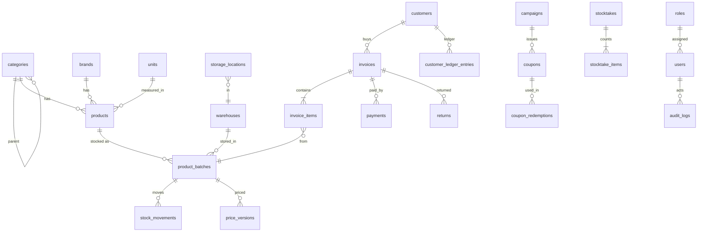

# پایگاه‌داده (§327) — نمای واقعی از مدل‌های SQLAlchemy

> تولیدشده از `Base.metadata` در نسخهٔ 1.2.0 (منبع حقیقت: `backend/app/models/*.py` و Alembic).
> SQLite محلی (`data/supermarket.db`)، مهاجرت‌های **فقط افزودنی** (§29, §274). Product ≠ Batch: قیمت/انقضا/موجودی همیشه روی `product_batches` است.

## مهاجرت‌ها (Alembic)

| فایل | محتوا |
|---|---|
| `3590913a6c4d` initial_schema | همهٔ جداول هسته |
| `c2f10a9b3e01` counters | شمارنده‌های اتمی (INV-, INT-, B-) |
| `d7a41c0f5b02` resolver_source_code | `product_resolver_results.source_code` |
| `e5b21c74a903` phase7 | عیب‌یابی، پیامک، سخت‌افزار، اعلان‌ها |
| `a1c93f4d7e10` phase9_ledger | دفتر حساب مشتری، برگشت‌ها |
| `b7e4d2019f31` phase11_batch_pricing | `price_versions` (تاریخچهٔ تغییرناپذیر قیمت) |
| `c8d1e2f3a410` v1_1_warehouses | انبارها، محل نگهداری، تخفیف فاکتور، والد دسته |

## جداول

### کاتالوگ

**`categories`** — `id` INTEGER PK; `name` VARCHAR(128) NOT NULL; `code` VARCHAR(64); `parent_id` INTEGER FK→categories; `is_active` BOOLEAN NOT NULL; `created_at` DATETIME NOT NULL; `updated_at` DATETIME NOT NULL; `deleted_at` DATETIME

**`brands`** — `id` INTEGER PK; `name` VARCHAR(128) NOT NULL; `code` VARCHAR(64); `description` TEXT; `is_active` BOOLEAN NOT NULL; `created_at` DATETIME NOT NULL; `updated_at` DATETIME NOT NULL; `deleted_at` DATETIME

**`units`** — `id` INTEGER PK; `name` VARCHAR(64) UNIQUE NOT NULL; `symbol` VARCHAR(16); `allow_decimal` BOOLEAN NOT NULL; `decimals` INTEGER NOT NULL; `is_active` BOOLEAN NOT NULL; `created_at` DATETIME NOT NULL; `updated_at` DATETIME NOT NULL

**`products`** — `id` INTEGER PK; `barcode` VARCHAR(64) UNIQUE NOT NULL; `sku` VARCHAR(64); `name` VARCHAR(255) NOT NULL; `brand_id` INTEGER FK→brands; `category_id` INTEGER FK→categories; `unit_id` INTEGER FK→units; `model` VARCHAR(128); `description` TEXT; `image_url` TEXT; `min_stock_alert` INTEGER NOT NULL; `is_active` BOOLEAN NOT NULL; `has_own_barcode` BOOLEAN NOT NULL; `created_at` DATETIME NOT NULL; `updated_at` DATETIME NOT NULL; `deleted_at` DATETIME

**`external_sources`** — `id` INTEGER PK; `code` VARCHAR(32) UNIQUE NOT NULL; `name` VARCHAR(128) NOT NULL; `source_type` VARCHAR(16) NOT NULL; `priority` INTEGER NOT NULL; `base_url` VARCHAR(255); `api_key` TEXT; `connection` TEXT; `is_active` BOOLEAN NOT NULL; `created_at` DATETIME NOT NULL; `updated_at` DATETIME NOT NULL

**`product_resolver_results`** — `id` INTEGER PK; `barcode` VARCHAR(64) NOT NULL; `source_id` INTEGER FK→external_sources; `source_code` VARCHAR(64); `field` VARCHAR(32) NOT NULL; `value` TEXT NOT NULL; `confidence` VARCHAR(16) NOT NULL; `status` VARCHAR(16) NOT NULL; `product_id` INTEGER FK→products; `created_at` DATETIME NOT NULL; `updated_at` DATETIME NOT NULL

**`image_assets`** — `id` INTEGER PK; `product_id` INTEGER FK→products; `barcode` VARCHAR(64); `source_id` INTEGER FK→external_sources; `url` TEXT NOT NULL; `local_path` TEXT; `width` INTEGER; `height` INTEGER; `format` VARCHAR(16); `confidence` VARCHAR(16) NOT NULL; `is_primary` BOOLEAN NOT NULL; `status` VARCHAR(16) NOT NULL; `created_at` DATETIME NOT NULL; `updated_at` DATETIME NOT NULL

**`market_prices`** — `id` INTEGER PK; `product_id` INTEGER FK→products; `barcode` VARCHAR(64); `source_id` INTEGER FK→external_sources; `price` NUMERIC(14, 2) NOT NULL; `currency` VARCHAR(8) NOT NULL; `confidence` VARCHAR(16) NOT NULL; `observed_at` DATETIME NOT NULL; `created_at` DATETIME NOT NULL; `updated_at` DATETIME NOT NULL

### انبار و Batch

**`product_batches`** — `id` INTEGER PK; `product_id` INTEGER FK→products NOT NULL; `batch_number` VARCHAR(64) NOT NULL; `quantity_received` NUMERIC(14, 3) NOT NULL; `current_qty` NUMERIC(14, 3) NOT NULL; `buy_price` NUMERIC(14, 2) NOT NULL; `supplier_price` NUMERIC(14, 2); `consumer_price` NUMERIC(14, 2) NOT NULL; `sell_price` NUMERIC(14, 2) NOT NULL; `discount` NUMERIC(14, 2) NOT NULL; `tax` NUMERIC(14, 2) NOT NULL; `production_date` DATE; `expiry_date` DATE; `received_at` DATETIME NOT NULL; `status` VARCHAR(16) NOT NULL; `warehouse_id` INTEGER; `location_id` INTEGER; `note` TEXT; `created_at` DATETIME NOT NULL; `updated_at` DATETIME NOT NULL

**`stock_movements`** — `id` INTEGER PK; `product_id` INTEGER FK→products NOT NULL; `batch_id` INTEGER FK→product_batches; `movement_type` VARCHAR(24) NOT NULL; `quantity` NUMERIC(14, 3) NOT NULL; `reference_type` VARCHAR(32); `reference_id` INTEGER; `unit_cost` NUMERIC(14, 2); `note` TEXT; `created_by` INTEGER FK→users; `created_at` DATETIME NOT NULL; `updated_at` DATETIME NOT NULL

**`stocktakes`** — `id` INTEGER PK; `name` VARCHAR(128) NOT NULL; `status` VARCHAR(16) NOT NULL; `area` VARCHAR(128); `note` TEXT; `started_at` DATETIME; `completed_at` DATETIME; `created_by` INTEGER FK→users; `completed_by` INTEGER FK→users; `warehouse_id` INTEGER; `cursor_item_id` INTEGER; `created_at` DATETIME NOT NULL; `updated_at` DATETIME NOT NULL

**`stocktake_items`** — `id` INTEGER PK; `stocktake_id` INTEGER FK→stocktakes NOT NULL; `product_id` INTEGER FK→products NOT NULL; `batch_id` INTEGER FK→product_batches; `system_qty` NUMERIC(14, 3) NOT NULL; `physical_qty` NUMERIC(14, 3); `difference` NUMERIC(14, 3) NOT NULL; `reason` VARCHAR(255); `status` VARCHAR(16) NOT NULL; `counted_at` DATETIME; `counted_by` INTEGER FK→users

**`warehouses`** — `id` INTEGER PK; `name` VARCHAR(128) NOT NULL; `code` VARCHAR(32); `address` TEXT; `is_default` BOOLEAN NOT NULL; `is_active` BOOLEAN NOT NULL; `created_at` DATETIME NOT NULL; `updated_at` DATETIME NOT NULL

**`storage_locations`** — `id` INTEGER PK; `warehouse_id` INTEGER FK→warehouses NOT NULL; `name` VARCHAR(128) NOT NULL; `code` VARCHAR(32); `is_active` BOOLEAN NOT NULL; `created_at` DATETIME NOT NULL; `updated_at` DATETIME NOT NULL

**`counters`** — `name` VARCHAR(64) PK; `value` INTEGER NOT NULL

### فروش و مشتری

**`invoices`** — `id` INTEGER PK; `invoice_number` VARCHAR(32) UNIQUE NOT NULL; `customer_id` INTEGER FK→customers; `subtotal` NUMERIC(14, 2) NOT NULL; `discount` NUMERIC(14, 2) NOT NULL; `invoice_discount` NUMERIC(14, 2) NOT NULL; `tax` NUMERIC(14, 2) NOT NULL; `total_amount` NUMERIC(14, 2) NOT NULL; `payment_method` VARCHAR(16) NOT NULL; `payment_status` VARCHAR(24) NOT NULL; `status` VARCHAR(24) NOT NULL; `print_status` VARCHAR(16) NOT NULL; `paid_at` DATETIME; `created_by` INTEGER FK→users; `created_at` DATETIME NOT NULL; `updated_at` DATETIME NOT NULL

**`invoice_items`** — `id` INTEGER PK; `invoice_id` INTEGER FK→invoices NOT NULL; `product_id` INTEGER FK→products NOT NULL; `batch_id` INTEGER FK→product_batches; `qty` NUMERIC(14, 3) NOT NULL; `unit_buy_price` NUMERIC(14, 2) NOT NULL; `unit_consumer_price` NUMERIC(14, 2) NOT NULL; `unit_sell_price` NUMERIC(14, 2) NOT NULL; `discount` NUMERIC(14, 2) NOT NULL; `tax` NUMERIC(14, 2) NOT NULL; `subtotal` NUMERIC(14, 2) NOT NULL; `profit` NUMERIC(14, 2) NOT NULL; `created_at` DATETIME NOT NULL

**`payments`** — `id` INTEGER PK; `invoice_id` INTEGER FK→invoices NOT NULL; `method` VARCHAR(16) NOT NULL; `amount` NUMERIC(14, 2) NOT NULL; `created_at` DATETIME NOT NULL; `updated_at` DATETIME NOT NULL

**`customers`** — `id` INTEGER PK; `name` VARCHAR(128) NOT NULL; `last_name` VARCHAR(128); `phone` VARCHAR(32); `email` VARCHAR(255); `address` VARCHAR(512); `notes` VARCHAR(1024); `credit_enabled` BOOLEAN NOT NULL; `credit_limit` NUMERIC(14, 2) NOT NULL; `is_active` BOOLEAN NOT NULL; `created_at` DATETIME NOT NULL; `updated_at` DATETIME NOT NULL

**`customer_ledger_entries`** — `id` INTEGER PK; `customer_id` INTEGER FK→customers NOT NULL; `entry_type` VARCHAR(24) NOT NULL; `amount` NUMERIC(14, 2) NOT NULL; `balance_after` NUMERIC(14, 2) NOT NULL; `invoice_id` INTEGER FK→invoices; `method` VARCHAR(16); `note` VARCHAR(512); `created_by` INTEGER FK→users; `created_at` DATETIME NOT NULL; `updated_at` DATETIME NOT NULL

**`returns`** — `id` INTEGER PK; `invoice_id` INTEGER FK→invoices NOT NULL; `invoice_item_id` INTEGER FK→invoice_items NOT NULL; `batch_id` INTEGER FK→product_batches; `qty` NUMERIC(14, 3) NOT NULL; `reason` VARCHAR(255); `status` VARCHAR(16) NOT NULL; `refund_amount` NUMERIC(14, 2) NOT NULL; `created_by` INTEGER FK→users; `created_at` DATETIME NOT NULL; `updated_at` DATETIME NOT NULL

**`price_versions`** — `id` INTEGER PK; `product_id` INTEGER FK→products NOT NULL; `price_type` VARCHAR(16) NOT NULL; `price` NUMERIC(14, 2) NOT NULL; `effective_from` DATETIME NOT NULL; `effective_to` DATETIME; `source` VARCHAR(64); `note` VARCHAR(255); `is_active` BOOLEAN NOT NULL; `created_by` INTEGER FK→users; `created_at` DATETIME NOT NULL; `updated_at` DATETIME NOT NULL

### بازاریابی

**`campaigns`** — `id` INTEGER PK; `name` VARCHAR(128) NOT NULL; `description` TEXT; `discount_type` VARCHAR(16) NOT NULL; `discount_value` NUMERIC(14, 2) NOT NULL; `min_purchase` NUMERIC(14, 2) NOT NULL; `max_discount` NUMERIC(14, 2); `valid_from` DATETIME; `valid_until` DATETIME; `auto_issue_threshold` NUMERIC(14, 2); `auto_issue_validity_days` INTEGER NOT NULL; `auto_issue_sms` BOOLEAN NOT NULL; `status` VARCHAR(16) NOT NULL; `created_by` INTEGER FK→users; `created_at` DATETIME NOT NULL; `updated_at` DATETIME NOT NULL

**`coupons`** — `id` INTEGER PK; `code` VARCHAR(48) UNIQUE NOT NULL; `campaign_id` INTEGER FK→campaigns; `customer_id` INTEGER FK→customers; `customer_phone` VARCHAR(32); `discount_type` VARCHAR(16) NOT NULL; `discount_value` NUMERIC(14, 2) NOT NULL; `min_purchase` NUMERIC(14, 2) NOT NULL; `max_discount` NUMERIC(14, 2); `valid_from` DATETIME; `valid_until` DATETIME; `usage_limit` INTEGER NOT NULL; `used_count` INTEGER NOT NULL; `status` VARCHAR(16) NOT NULL; `note` TEXT; `created_by` INTEGER FK→users; `created_at` DATETIME NOT NULL; `updated_at` DATETIME NOT NULL

**`coupon_redemptions`** — `id` INTEGER PK; `coupon_id` INTEGER FK→coupons NOT NULL; `invoice_id` INTEGER FK→invoices; `customer_id` INTEGER FK→customers; `amount` NUMERIC(14, 2) NOT NULL; `created_at` DATETIME NOT NULL; `created_by` INTEGER FK→users

### سیستم

**`users`** — `id` INTEGER PK; `username` VARCHAR(64) UNIQUE NOT NULL; `full_name` VARCHAR(128) NOT NULL; `email` VARCHAR(255); `password_hash` VARCHAR(255) NOT NULL; `is_active` BOOLEAN NOT NULL; `last_login_at` DATETIME; `created_at` DATETIME NOT NULL; `updated_at` DATETIME NOT NULL

**`roles`** — `id` INTEGER PK; `name` VARCHAR(64) UNIQUE NOT NULL; `description` VARCHAR(255) NOT NULL; `is_system` BOOLEAN NOT NULL; `created_at` DATETIME NOT NULL; `updated_at` DATETIME NOT NULL

**`permissions`** — `id` INTEGER PK; `code` VARCHAR(64) UNIQUE NOT NULL; `description` VARCHAR(255) NOT NULL

**`system_settings`** — `id` INTEGER PK; `key` VARCHAR(64) UNIQUE NOT NULL; `value` TEXT NOT NULL; `description` TEXT; `is_secret` BOOLEAN NOT NULL; `created_at` DATETIME NOT NULL; `updated_at` DATETIME NOT NULL

**`audit_logs`** — `id` INTEGER PK; `user_id` INTEGER FK→users; `action` VARCHAR(48) NOT NULL; `entity_type` VARCHAR(32); `entity_id` INTEGER; `before` TEXT; `after` TEXT; `reference` VARCHAR(255); `ip_address` VARCHAR(64); `created_at` DATETIME NOT NULL

**`notifications`** — `id` INTEGER PK; `type` VARCHAR(32) NOT NULL; `title` VARCHAR(255) NOT NULL; `body` TEXT; `severity` VARCHAR(16) NOT NULL; `reference_type` VARCHAR(32); `reference_id` INTEGER; `is_read` BOOLEAN NOT NULL; `created_at` DATETIME NOT NULL

**`sync_jobs`** — `id` INTEGER PK; `job_type` VARCHAR(32) NOT NULL; `payload` TEXT NOT NULL; `status` VARCHAR(16) NOT NULL; `attempts` INTEGER NOT NULL; `max_attempts` INTEGER NOT NULL; `last_error` TEXT; `next_attempt_at` DATETIME; `completed_at` DATETIME; `reference_type` VARCHAR(32); `reference_id` INTEGER; `idempotency_key` VARCHAR(96) UNIQUE; `created_by` INTEGER FK→users; `created_at` DATETIME NOT NULL; `updated_at` DATETIME NOT NULL

**`diagnostic_runs`** — `id` INTEGER PK; `started_at` DATETIME NOT NULL; `finished_at` DATETIME; `total` INTEGER NOT NULL; `passed` INTEGER NOT NULL; `failed` INTEGER NOT NULL; `skipped` INTEGER NOT NULL; `report` TEXT NOT NULL; `created_by` INTEGER FK→users

**`sms_messages`** — `id` INTEGER PK; `phone` VARCHAR(32) NOT NULL; `text` TEXT NOT NULL; `status` VARCHAR(16) NOT NULL; `retry_count` INTEGER NOT NULL; `error_message` TEXT; `provider_response` TEXT; `sent_at` DATETIME; `reference_type` VARCHAR(32); `reference_id` INTEGER; `created_at` DATETIME NOT NULL; `updated_at` DATETIME NOT NULL

**`hardware_devices`** — `id` INTEGER PK; `device_type` VARCHAR(24) NOT NULL; `name` VARCHAR(128) NOT NULL; `vendor` VARCHAR(128); `model` VARCHAR(128); `connection` TEXT; `status` VARCHAR(16) NOT NULL; `paper_width_mm` INTEGER; `is_enabled` BOOLEAN NOT NULL; `created_at` DATETIME NOT NULL; `updated_at` DATETIME NOT NULL

### سایر

**`user_roles`** — `user_id`, `role_id`

**`role_permissions`** — `role_id`, `permission_id`

## قواعد کلیدی

* `stock_movements.movement_type ∈ {IN, SALE_OUT, RETURN_IN, WASTE, ADJUSTMENT, TRANSFER}`؛ موجودی هر Batch = جمع حرکات (بدون ویرایش مستقیم).
* `price_versions` فقط INSERT (تاریخچهٔ قیمت تغییرناپذیر §72).
* `invoices.invoice_number = INV-YYYYMMDD-NNNNNN`؛ `products.barcode = INT-NNNNNN` برای کالای بدون GTIN (از `counters`).
* `system_settings.is_secret=true` هرگز به کلاینت برنمی‌گردد (write-only).
* `audit_logs` برای همهٔ رخدادهای §43 (فروش، ابطال، تخفیف، تغییر قیمت، چاپ، پیامک، به‌روزرسانی، ورود/خروج، تغییر تنظیمات).
* پشتیبان‌گیری: SQLite online backup API (`/api/system/backup`)، اعتبارسنجی `integrity_check` پیش از بازگردانی.

## نمودار ER (خلاصه)

