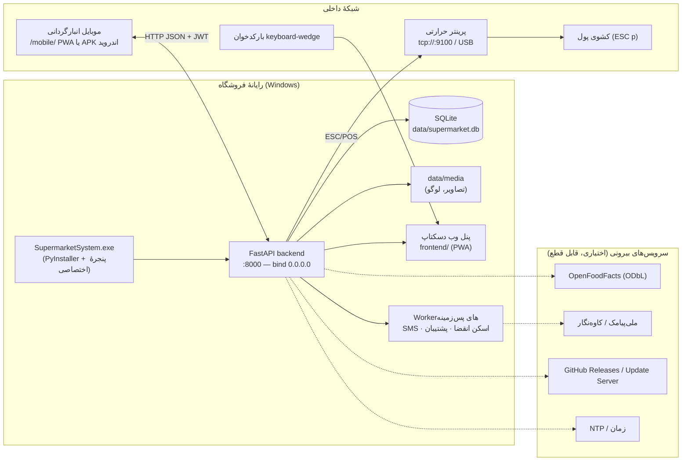
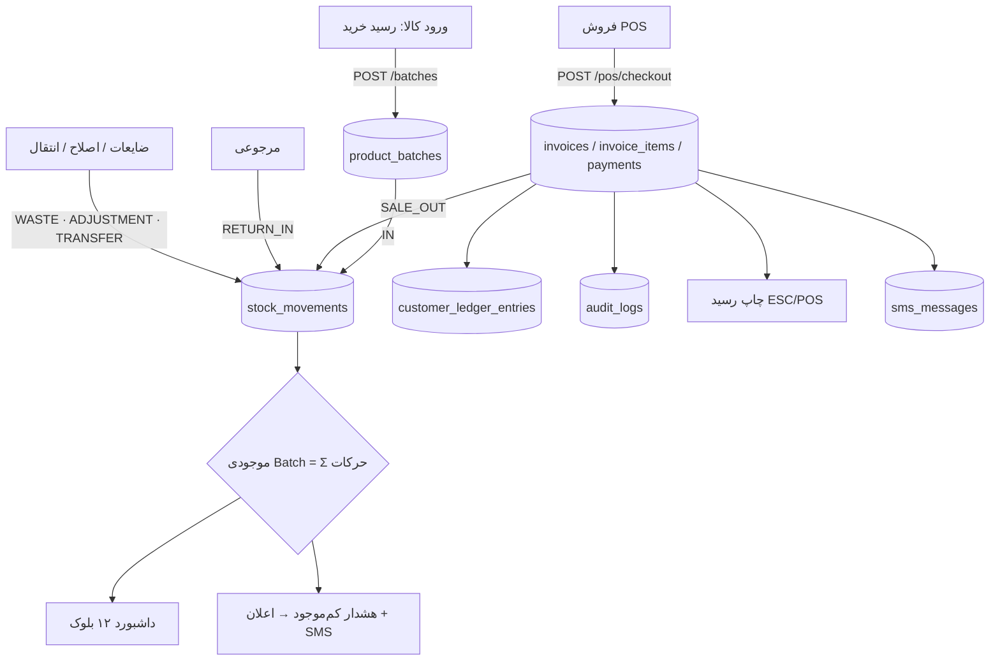
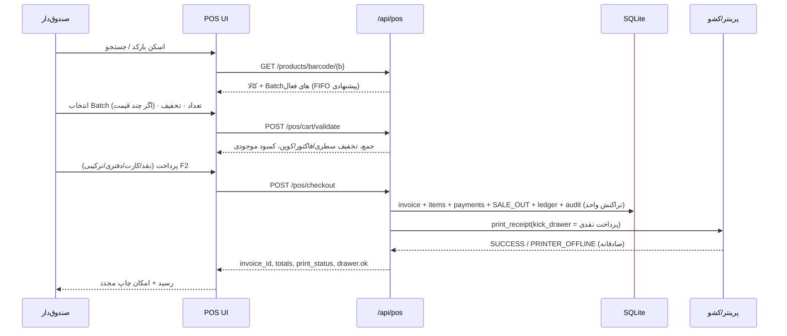
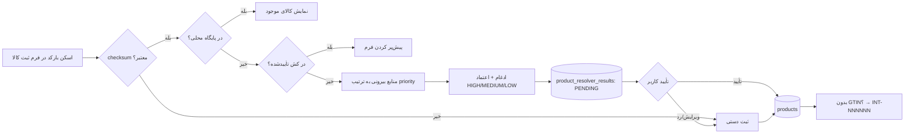
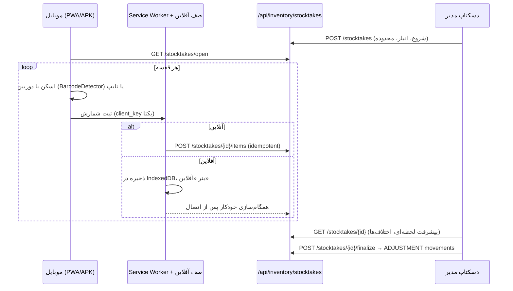
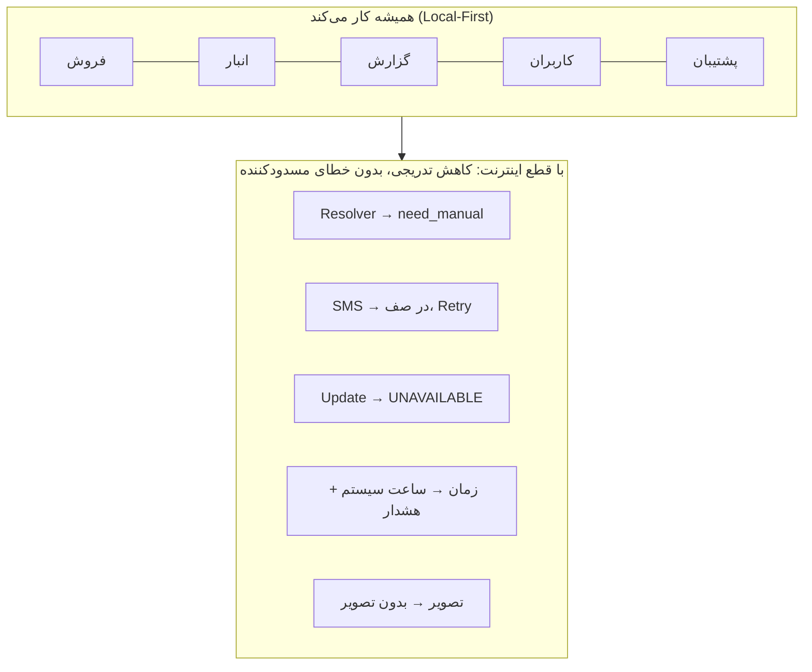
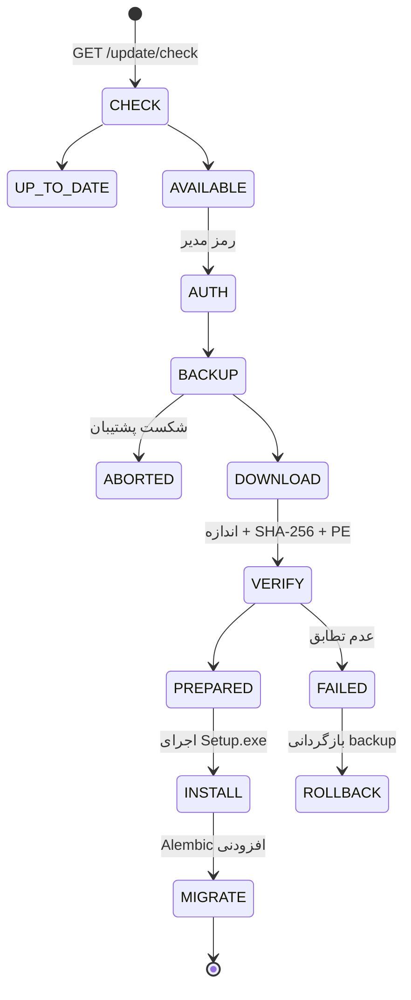

# نقشه‌ها و نمودارهای سامانه (§334–§341)

همهٔ نمودارها Mermaid هستند و در GitHub/VS Code مستقیم رندر می‌شوند. نمودار ER کامل در `DATABASE.md`.

## ۱. معماری کلی (§334)

## ۲. جریان داده (§335)

## ۳. جریان فروش (§339)

## ۴. ثبت محصول و Resolver (§340)

## ۵. انبارگردانی موبایل ↔ دسکتاپ (§337, §338)

## ۶. سرویس‌های خارجی و رفتار قطع (§341)

## ۷. به‌روزرسانی امن (§266–§276)

