# راهنمای تصویری سامانه — معرفی بخش‌ها (فاز ۸)

> همهٔ تصاویر این سند **خروجی واقعی از رابط کاربری** هستند؛ در تاریخ
> 2026-09-04 با `scripts/shoot.py` از سرور در حال اجرا (رندر offscreen در
> Chromium/QtWebEngine) گرفته شده‌اند — نه طراحی یا موکاپ. داده‌های داخل
> تصاویر واقعی‌اند: در همین جریان، یک فروش واقعی در صندوق ثبت شده
> (فاکتور `INV-20260904-000001` به مبلغ 82,000 ریال) و پیشرفت جلسهٔ
> انبارگردانی از 2/7 به 3/7 رسیده است.

## نقشهٔ کلی سامانه

سامانه دو رابط دارد:

1. **پنل مدیریت/صندوق (وب‌اپ دسکتاپ)** — `http://127.0.0.1:PORT/`
   برای مدیر، صندوق‌دار و انباردار؛ با نقش‌محور بودن منو (هر کاربر فقط
   بخش‌های مجاز خودش را می‌بیند).
2. **اپ موبایل انبارگردانی (PWA)** — `http://127.0.0.1:PORT/mobile/`
   برای اپراتور انبار؛ قابل نصب روی گوشی (manifest + service worker)،
   کارکرد آفلاین با IndexedDB و همگام‌سازی بعد از اتصال.

---

## بخش ۱ — ورود به پنل مدیریت

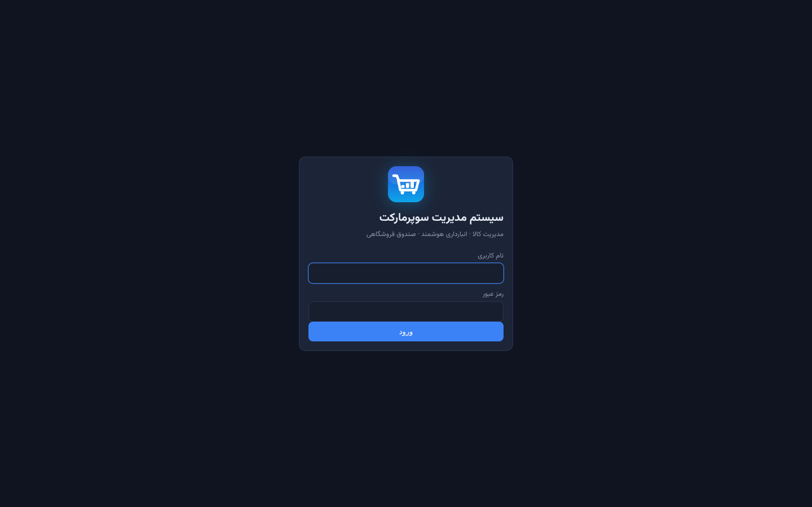

اولین صفحهٔ سامانه. کاربر با نام کاربری و رمز وارد می‌شود؛ احراز هویت با
JWT انجام می‌شود و توکن تا ۱۲ ساعت معرفی است. منوی داخلی بر اساس
**مجوزهای نقش** کاربر ساخته می‌شود — کاربری که مجاز به «مدیریت کاربران»
نیست، آن بخش را اصلاً نمی‌بیند.

## بخش ۲ — داشبورد مدیریتی

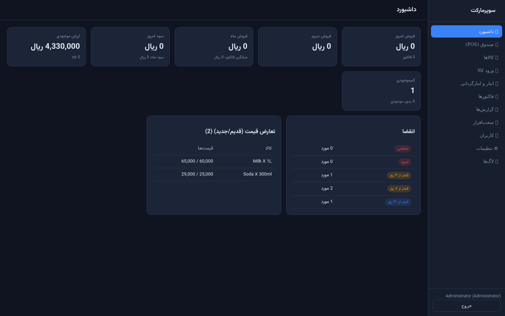

نمای یک‌نگاهی مدیر: فروش امروز/دیروز/ماه، تعداد فاکتور، سود، میانگین
سبد خرید، ارزش موجودی انبار به بهای تمام‌شده، هشدار کم‌موجودی و موارد
انقضا. همهٔ اعداد با **کوئری‌های SQL تجمعی** (بدون بارگذاری رکوردها در
حافظه) محاسبه می‌شوند — روی دادهٔ واقعیِ همین تصویر، فروش امروز همان
فاکتوری است که در بخش صندوق همین‌جا دیده می‌شود.

## بخش ۳ — صندوق فروش (POS)

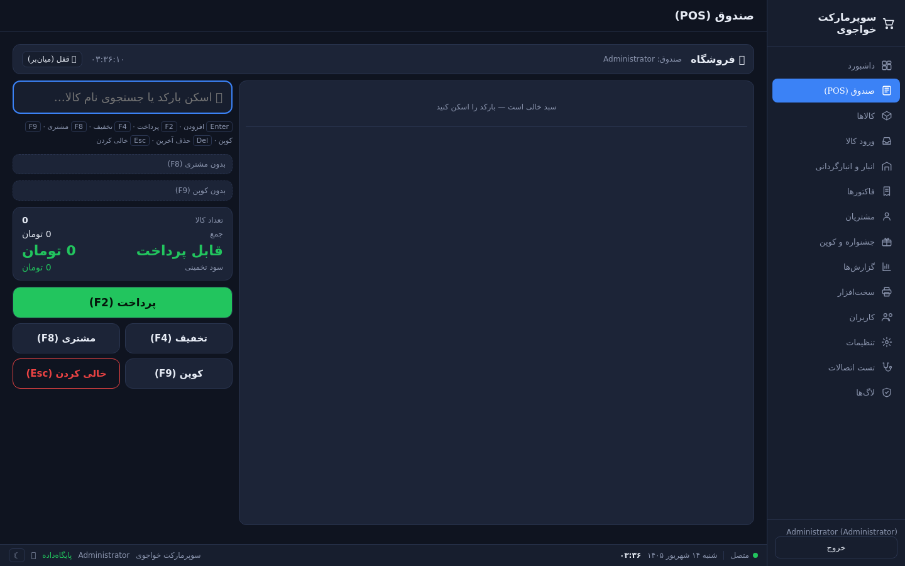

محیط اختصاصی صندوق‌دار با چیدمان تمام‌صفحه: سبد سمت راست، نوار اسکن
بارکد، میان‌برهای صفحه‌کلید (Enter افزودن، F2 پرداخت، F4 تخفیف، F8
مشتری، Del حذف، Esc خالی‌کردن) و ساعت زنده. دکمهٔ «قفل (میان‌بر)»
سامانه را به **حالت کیوسک** می‌برد که فقط همین صفحه در دسترس است و خروج
با میان‌بر مدیر ممکن است — برای جلوگیری از دسترسی صندوق‌دار به بقیهٔ
سامانه.

## بخش ۴ — فروش کالای چندقیمتی: انتخاب Batch/قیمت

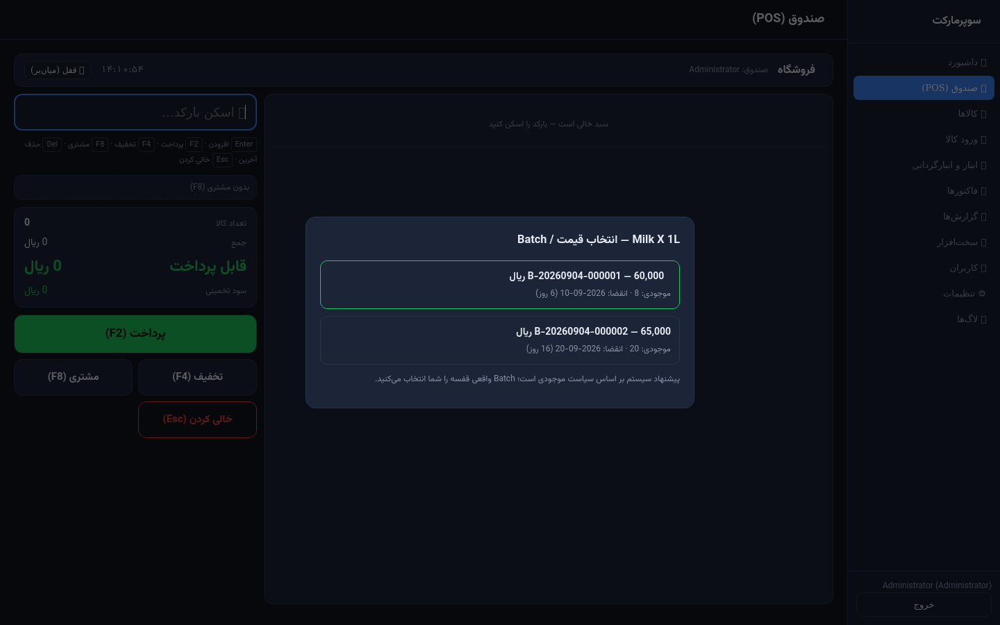

وقتی بارکد اسکن‌شده چند گزینه دارد (مثلاً شیر با قیمت قدیمی و جدید از
دو ورودی متفاوت)، صندوق‌دار **خودش** Batch واقعی روی قفسه را انتخاب
می‌کند و سیستم فقط پیشنهاد می‌دهد (⭐). این تصویر همان لحظهٔ تصمیم است —
کالا «Milk X 1L» با دو قیمت 60,000 و 55,000 ریال.

## بخش ۵ — سبد خرید و جمع فاکتور

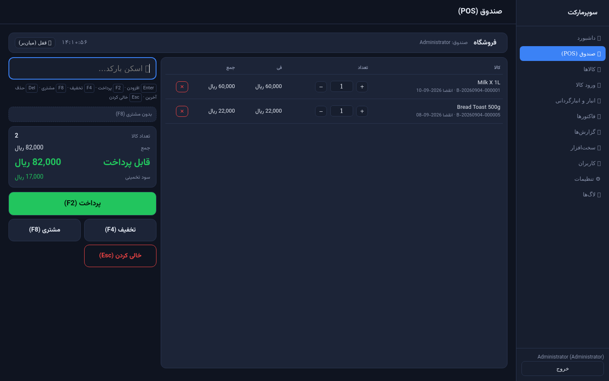

سبد بعد از افزودن دو کالا: ردیف‌های کالا/تعداد/قیمت در جدول سبد، تعداد،
جمع و مبلغ قابل پرداخت در ستون کناری. قیمت هر ردیف از **نسخهٔ قیمتِ همان
Batch** می‌آید (Product ≠ Batch ≠ PriceVersion).

## بخش ۶ — پرداخت

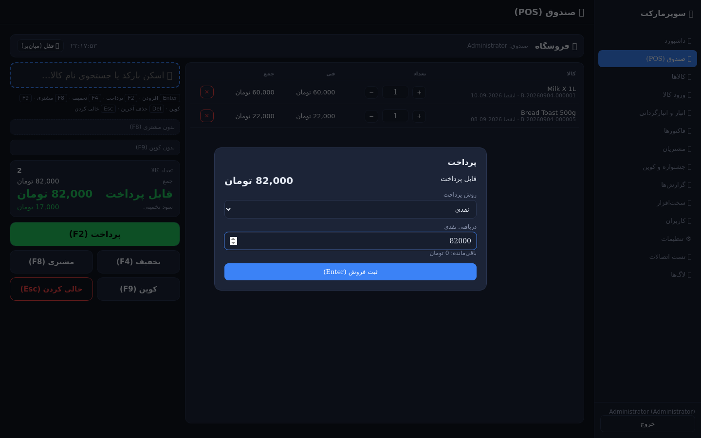

پنجرهٔ پرداخت: مبلغ قابل پرداخت، روش پرداخت (نقدی/کارت/ترکیبی)، دریافتی
نقدی و محاسبهٔ خودکار باقی‌مانده. با «ثبت فروش» فاکتور در دیتابیس ثبت،
موجودی Batch به‌صورت FIFO/سیاست‌محور کسر و گزارش‌ها به‌روز می‌شود.

## بخش ۷ — رسید فروش

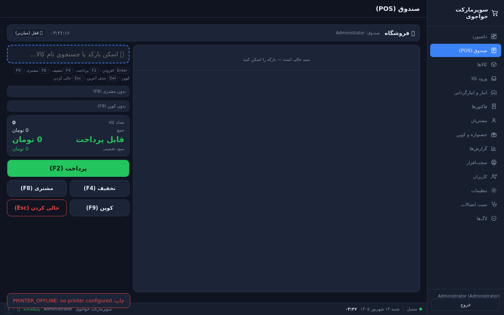

رسید فاکتورِ ثبت‌شده همان‌جا نمایش داده می‌شود (شمارهٔ فاکتور، ردیف‌ها،
مبلغ، روش پرداخت). این فاکتور واقعاً در دیتابیس ثبت شده و در بخش
«فاکتورها» و «گزارش‌ها» دیده می‌شود — همان‌طور که در تصاویر بعدی
می‌بینید.

## بخش ۸ — مدیریت کالاها

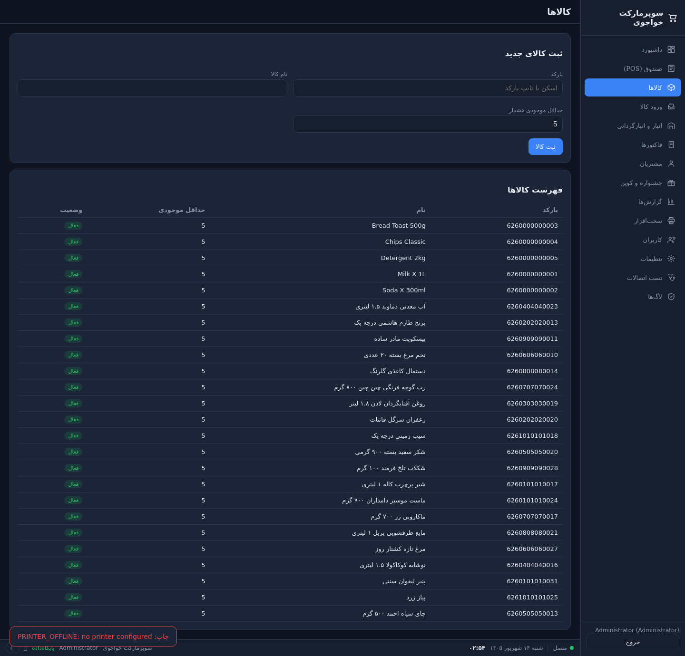

فهرست کالاها با بارکد، دسته، واحد و جستجو. کالا (محصول) با ورودی کالا
(Batch) و نسخهٔ قیمت جدا است؛ حذف/ویرایش کالا روی تاریخچهٔ مالی اثر
گذار نیست.

## بخش ۹ — ورود کالا (Batch)

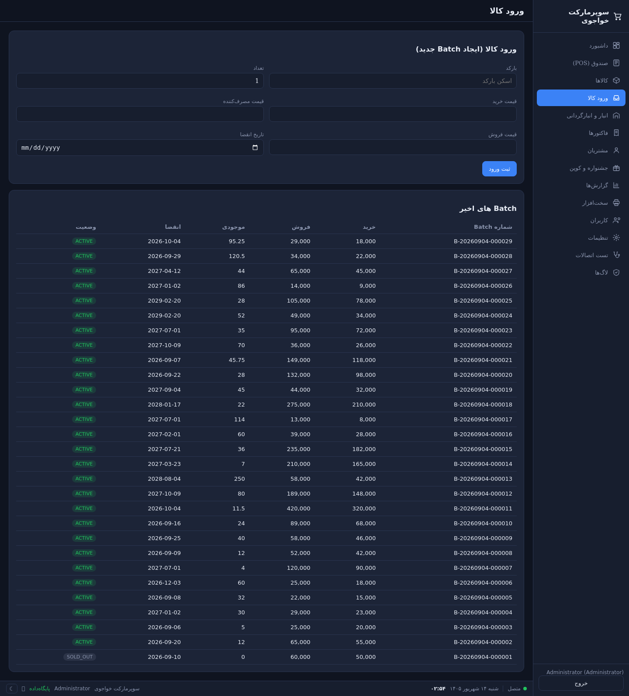

ثبت ورود کالا: شمارهٔ Batch، قیمت خرید، قیمت مصرف‌کننده، تاریخ انقضا و
تعداد. هر ورود یک «نسخهٔ قیمت» مستقل می‌سازد؛ قیمت‌گذاری قدیم/جدید و
سیاست FIFO/FEFO از همین‌جا پیگیری می‌شود.

## بخش ۱۰ — انبار و انبارگردانی

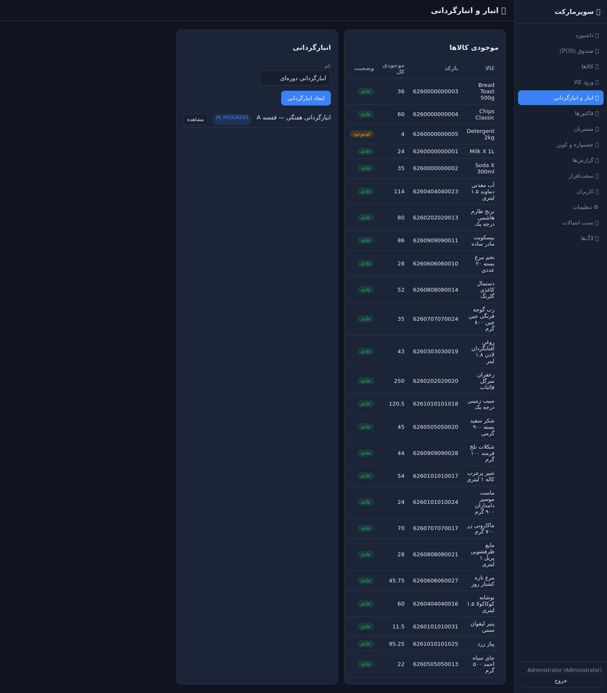

موجودی کل هر کالا با وضعیت (عادی/کم‌موجودی/بدون‌موجودی) و مدیریت
**جلسات انبارگردانی**: ساخت جلسه، پیشرفت شمارش (مثلاً 3 از 7)، رزومه‌کردن
جلسهٔ نیمه‌کاره، و **تأیید مدیر** بعد از پایان شمارش — قبل از تأیید، هیچ
تعدیلی روی موجودی رسمی اعمال نمی‌شود.

## بخش ۱۱ — فاکتورها

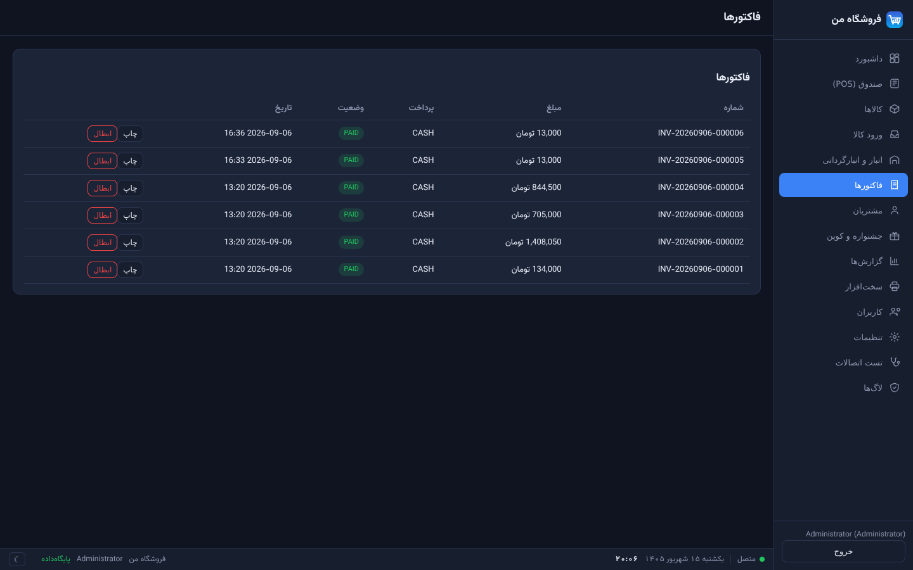

آرشیو فاکتورهای فروش با شماره، مبلغ، روش و وضعیت پرداخت. ردیف اول همان
فاکتوری است که در بخش ۷ ثبت شد.

## بخش ۱۲ — گزارش‌ها (۸ گزارش نقش‌محور)

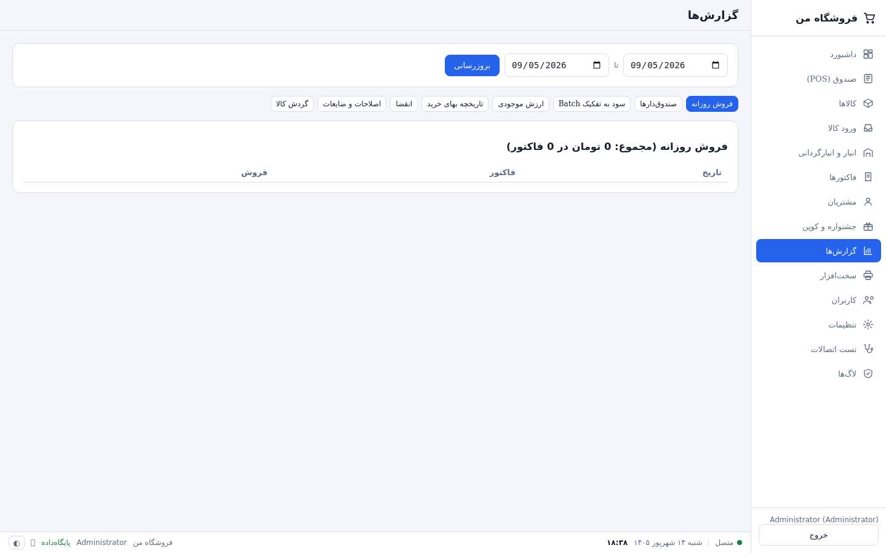

تب‌های گزارش: فروش روزانه، صندوق‌دارها، سود به تفکیک Batch، ارزش موجودی،
تاریخچهٔ بهای خرید، انقضا، اصلاحات و ضایعات، و گردش کالا — با فیلتر بازهٔ
تاریخ. نسخهٔ PDF همین گزارش هم به‌صورت خودکار تولید می‌شود
(`screenshots/12-admin-reports.pdf`).

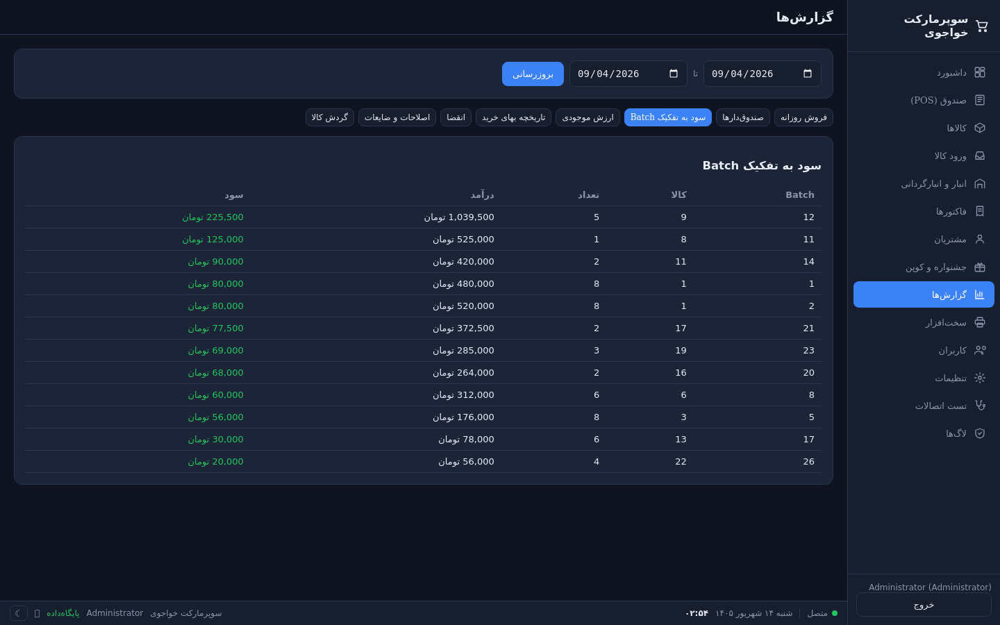

گزارش **صندوق‌دارها**: فروش هر صندوق‌دار در بازهٔ انتخابی — برای
حساب‌رسی روزانه.

## بخش ۱۳ — کاربران

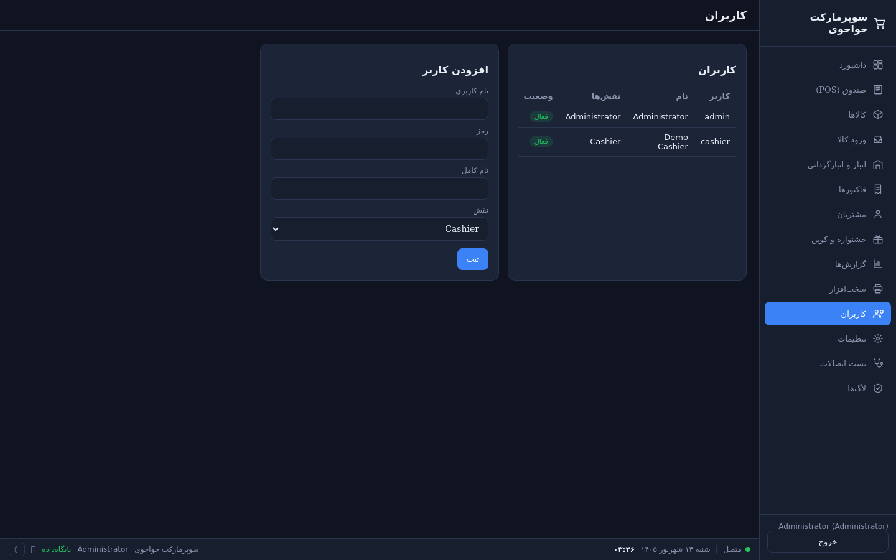

مدیریت کاربران و نقش‌ها (مدیر، صندوق‌دار، اپراتور انبار…). هر نقش مجموعهٔ
مجوزهایی دارد که منو و API هر دو آن را اعمال می‌کنند.

## بخش ۱۴ — تنظیمات

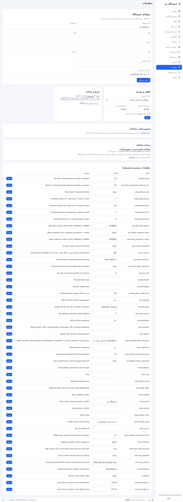

تنظیمات فروشگاه: نام، واحد پول، سیاست‌های فروش/انقضا و پیکربندی
رزالورهای بارکد (منابع خارجی و اولویت آن‌ها).

## بخش ۱۵ — لاگ‌ها (Audit)

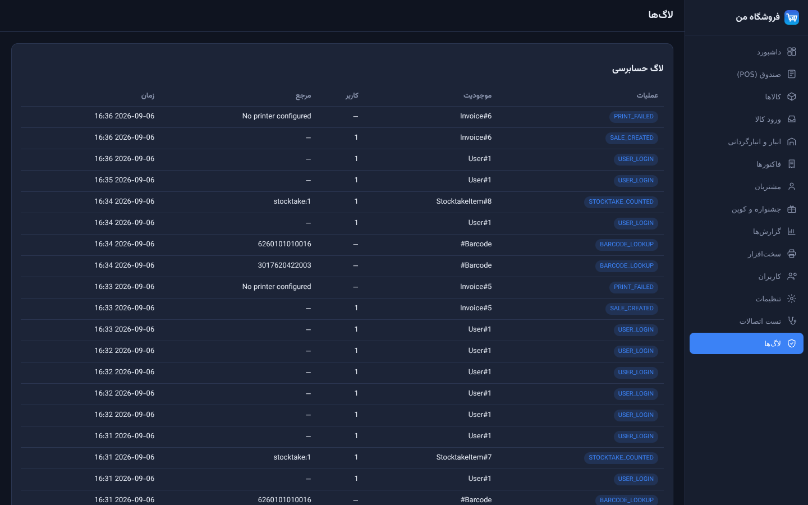

گزارش رخدادهای امنیتی و عملیاتی: ورودها، تغییر قیمت‌ها، اصلاحات موجودی،
تأیید انبارگردانی و… با کاربر و زمان — برای پیگیری مسئولیت.

## بخش ۱۶ — سخت‌افزار

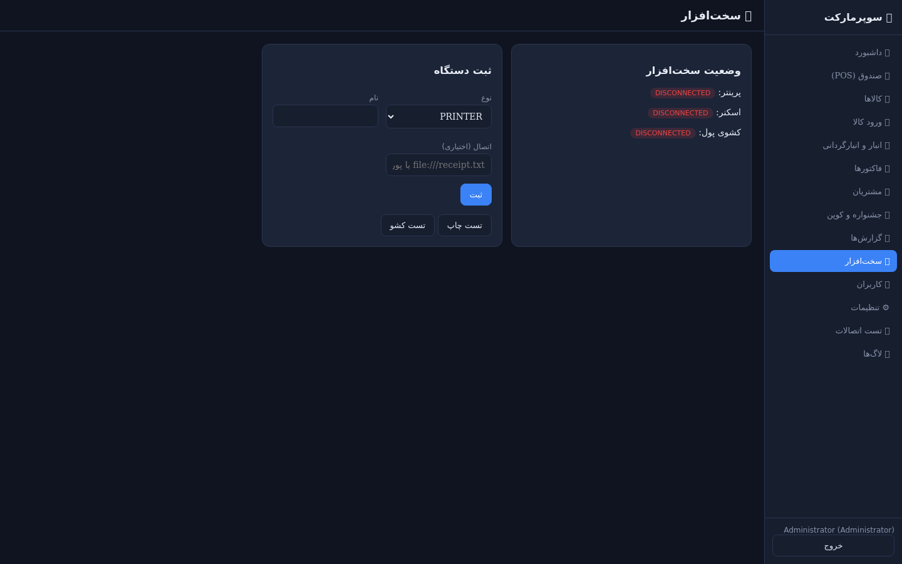

وضعیت و تنظیم دستگاه‌های جانبی: چاپگر رسید (ESC/POS)، بارکدخوان و
اتصال آن‌ها. در نبود دستگاه واقعی، وضعیت به‌صورت صادقانه «غیرفعال»
نمایش داده می‌شود (بدون شبیه‌سازی).

---

# اپ موبایل (PWA) — `/mobile/`

اپ موبایل **یک نسخهٔ کوچک‌شدهٔ پنل دسکتاپ نیست**؛ رابطی است که برای
انگشت شست، دوربین گوشی و ایستادن وسط راهرو طراحی شده: نوار تب پایین
(دسترس شست)، شیت‌های پایین‌کشویی به‌جای مودال، اهداف لمسی ۴۸ پیکسل
به بالا و آیکون‌های SVG درون‌خطی (مستقل از فونت ایموجی).

## موبایل ۱ — ورود

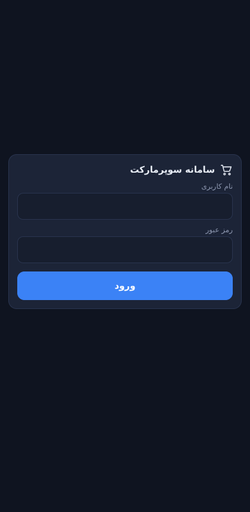

احراز هویت JWT مشترک با پنل. روی گوشی به‌صورت PWA نصب می‌شود
(manifest + service worker، آیکون مستقل، اجرای تمام‌صفحه).

## موبایل ۲ — خانه (داشبورد جیبی)

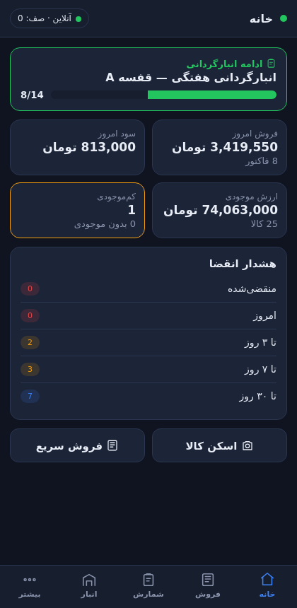

کارت «ادامه انبارگردانی» بالای صفحه: جلسهٔ نیمه‌کارهٔ کاربر با نوار
پیشرفت `7/14` مستقیماً از `/inventory/stocktake-sessions/active` خوانده
می‌شود، پس اپراتور بعد از بسته‌شدن اپ دقیقاً همان‌جا ادامه می‌دهد.
زیر آن KPIهای واقعی (فروش امروز 3,337,550 تومان از ۷ فاکتور واقعی، سود،
ارزش موجودی) و جدول هشدار انقضا در پنج سطل: منقضی‌شده / امروز / ۳ / ۷ /
۳۰ روز. نوار تب پایین: خانه، فروش، شمارش، انبار، بیشتر — تب‌ها بر اساس
**مجوز نقش** کاربر ساخته می‌شوند.

## موبایل ۳ — جستجوی کالا در صندوق موبایل


تایپ نام یا بارکد (اینجا «شیر») با debounce ۲۵۰ms به `/pos/search` می‌رود؛
هر نتیجه موجودی و **تعداد قیمت‌های فعال** را نشان می‌دهد. دکمهٔ دوربین
کنار جستجو اسکنر بارکد را باز می‌کند.

## موبایل ۴ — انتخاب قیمت وقتی کالا چند قیمت دارد

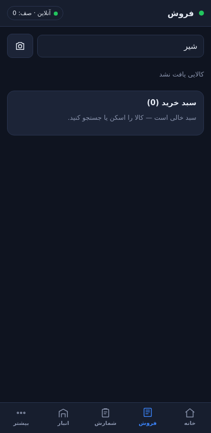

نمایش صریح سیاست قیمت‌گذاری سامانه: «شیر برچرب کاله ۱ لیتری» دو بچ با
دو قیمت دارد (52,000 و 58,000 تومان) و این دو **هرگز ادغام نمی‌شوند**.
شیت پایین هر دو را با شمارهٔ بچ، موجودی و تاریخ انقضا نشان می‌دهد و بچ
FIFO با نشان «پیشنهاد سیستم» علامت خورده — اما **به‌صورت خودکار اعمال
نمی‌شود**؛ تصمیم با فروشنده است. برای کالای وزنی (واحد اعشاری) پس از
انتخاب بچ، صفحهٔ ورود مقدار اعشاری باز می‌شود.

## موبایل ۵ — سبد خرید


هر سطر سبد با دکمه‌های −/+ (گام ۰٫۵ برای کالای وزنی، ۱ برای شمارشی) و
حذف؛ افزایش مقدار به موجودی همان بچ محدود می‌شود. مجموع قابل پرداخت در
نوار چسبان بالای تب‌بار.

## موبایل ۶ — پرداخت

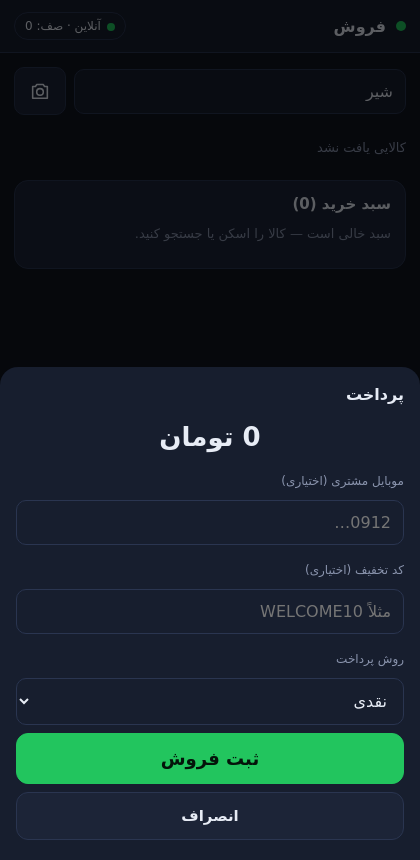

شیت پرداخت: مبلغ درشت، موبایل مشتری (اختیاری، برای پیامک و باشگاه
مشتریان)، **کد تخفیف** که پیش از ثبت با `/marketing/coupons/validate`
اعتبارسنجی می‌شود، و روش پرداخت. فاکتور از همان
`POST /pos/checkout` پنل دسکتاپ ثبت می‌شود — یک منطق فروش، دو رابط.

## موبایل ۷ — انبار

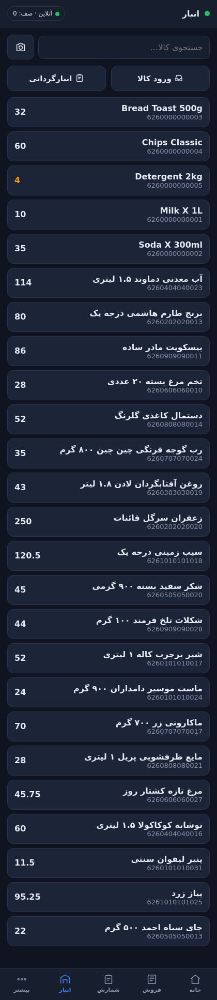

فهرست موجودی با جستجو و اسکن؛ اقلام زیر حد هشدار با رنگ کهربایی مشخص
می‌شوند. دو میان‌بر بالای صفحه: «ورود کالا» و «انبارگردانی».

## موبایل ۸ — ثبت ورود کالا با اسکن

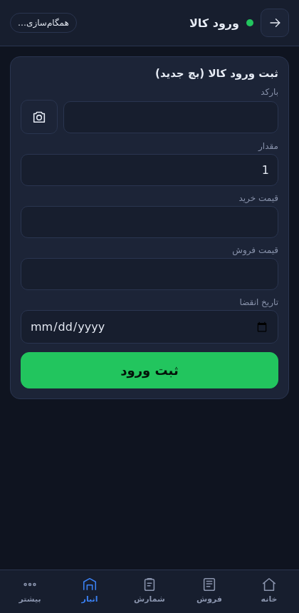

انباردار بارکد را اسکن می‌کند، سامانه کالا را از
`/products/barcode/{barcode}` پیدا می‌کند و مقدار/قیمت خرید/قیمت فروش/
تاریخ انقضا را می‌گیرد و **بچ جدید** می‌سازد — بدون ادغام با بچ‌های قبلی
و بدون نیاز به دانستن شناسهٔ داخلی کالا.

## موبایل ۹ — جلسات انبارگردانی

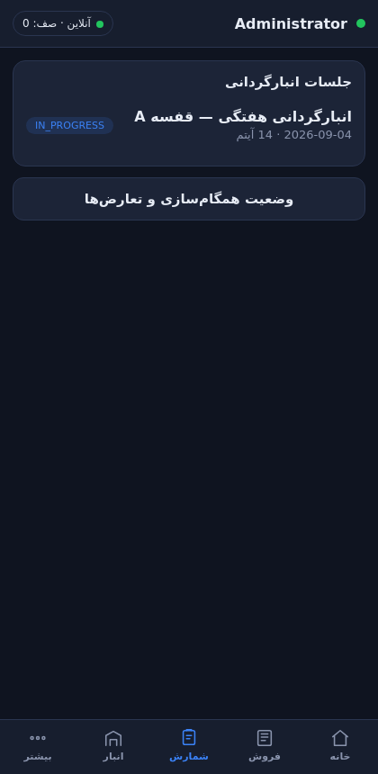

فهرست جلسات با وضعیت هر جلسه و نشانگر آنلاین/آفلاین. در حالت آفلاین،
آخرین نسخهٔ جلسه از IndexedDB نمایش داده می‌شود و شمارش‌ها در صف می‌مانند.

## موبایل ۱۰ — کارت شمارش

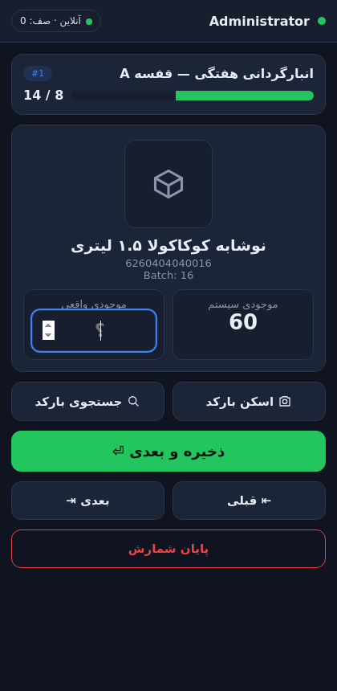

قلب انبارگردانی: نام جلسه و نوار پیشرفت، تصویر/نام/بارکد کالای جاری،
**موجودی سیستم** در مقابل **موجودی واقعی**. دکمه‌های اسکن دوربین، جستجوی
بارکد، «ذخیره و بعدی» و پیمایش. جلسه قابل رزومه است.
نسخهٔ PDF: `screenshots/27-mobile-count.pdf`.

## موبایل ۱۱ — ثبت شمارش و آیتم بعدی

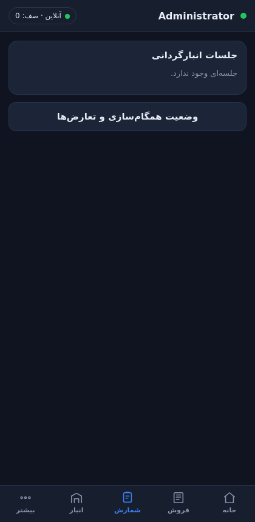

بعد از ثبت عدد، نوار پیشرفت جلو می‌رود و کارت آیتم بعدی می‌آید. اختلاف
هر شمارش ثبت می‌شود و در پایان جلسه **مدیر** نتیجه را تأیید/رد می‌کند —
اصلاح موجودی فقط پس از تأیید مدیر انجام می‌شود.

## موبایل ۱۲ — منوی «بیشتر»

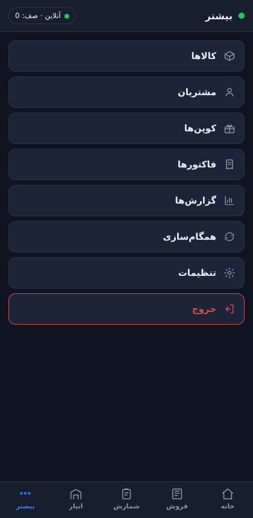

دسترسی به بقیهٔ ماژول‌ها از گوشی: کالاها، مشتریان، کوپن‌ها، فاکتورها،
گزارش‌ها، همگام‌سازی و تنظیمات.

## موبایل ۱۳ — گزارش‌ها

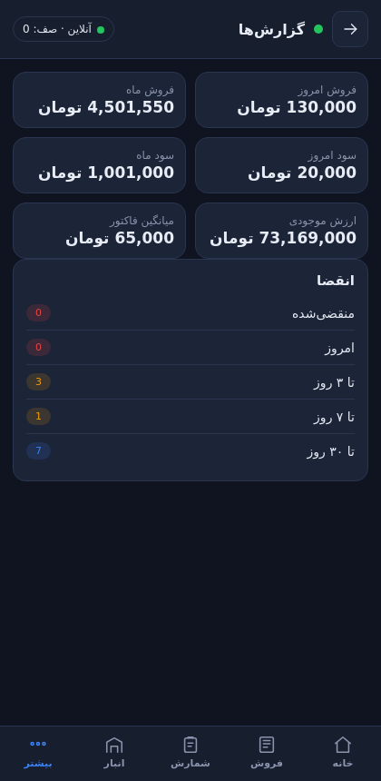

شش KPI اصلی (فروش امروز/ماه، سود امروز/ماه، ارزش موجودی، میانگین فاکتور)
به‌علاوهٔ سطل‌های انقضا — همان اعداد پنل دسکتاپ، چیدمان مخصوص گوشی.

## موبایل ۱۴ — همگام‌سازی و تعارض‌ها

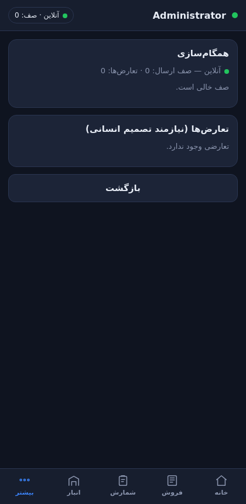

صف ارسال آفلاین و فهرست **تعارض‌ها**. اگر شمارشِ آفلاین هنگام ارسال با
تغییر سمت سرور برخورد کند، در سکوت بازنویسی نمی‌شود؛ به‌عنوان تعارض
نگهداری می‌شود تا انسان تصمیم بگیرد.

---

## نحوهٔ تولید مجدد تصاویر

```bash
# سرور را اجرا کنید (مثلاً uvicorn app.main:app --port 8000)
# پیش‌نیاز رندر offscreen (سیستم‌های بدون کتابخانه‌های Qt):
python scripts/make_qt_stublibs.py <venv>/lib/python3.11/site-packages/PySide6
LD_LIBRARY_PATH=scripts/stublibs QT_QPA_PLATFORM=offscreen \
  python scripts/shoot.py scripts/shots.json
# → docs/screenshots/*.png (+ PDF های مشخص‌شده)
```

مشخصات هر تصویر (URL، اندازه، مراحل تعامل) در `scripts/shots.json`
قابل مشاهده و ویرایش است.
