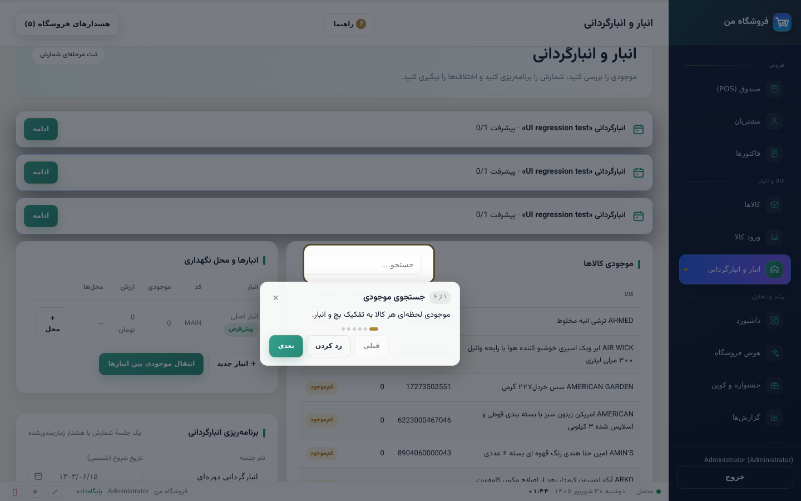
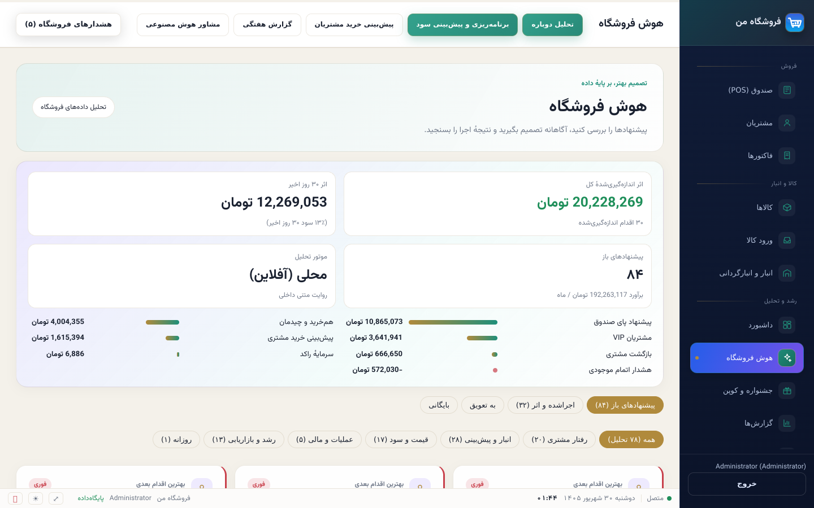
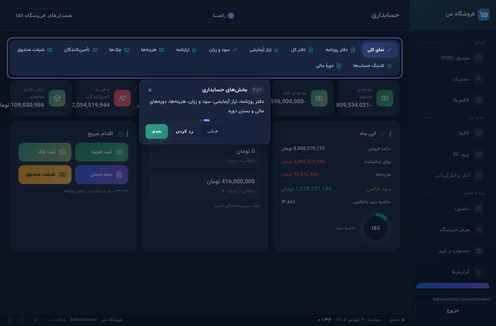
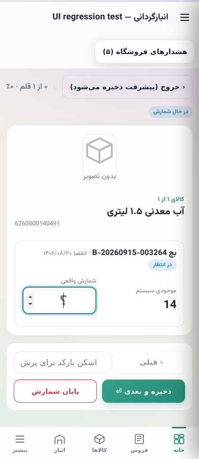

# رابط دسکتاپ ۳.۶.۶

## دریافت و اجرا در ویندوز

[دانلود بستهٔ رابط ویندوز](https://raw.githubusercontent.com/khajavy8056/Super-system-/v3.6.6/releases/windows/SupermarketDesktopUI-3.6.6.zip)

این ZIP، **رابط جدید برای نصب موجود ۳.۶.x** است؛ نصب‌کنندهٔ کامل یا فایل اجرایی جدید نیست. پس از بکاپ، برنامه را با خروج خودش ببندید، کل ZIP را در پوشهٔ جداگانه استخراج و `START-WINDOWS-UI.bat` را اجرا کنید. اگر محل نصب استاندارد نیست، فایل اجرایی نصب‌شده را روی BAT بکشید. برای بازگشت، برنامه را ببندید و میانبر قبلی را اجرا کنید.

راه‌انداز فقط متغیر `FRONTEND_DIR` را برای فرایند جدید تعیین می‌کند؛ بک‌اند از قبل این قابلیت را دارد. دیتابیس و فایل اجرایی قبلی دست‌نخورده‌اند و شمارهٔ نسخهٔ بک‌اند قبلی در تنظیمات تغییر نمی‌کند. راهنمای دقیق داخل ZIP است. اجرای خود BAT روی Windows آزمایش نشده؛ پشتیبانی مسیر رابط بیرونی و محتوای ZIP با آزمون خودکار بررسی شده‌اند.

**Setup.exe کامل جدید موجود نیست:** محیط فعلی لینوکس است و اتصال فعلی GitHub، workflow قابل‌اجرای ساخت ویندوز ندارد؛ انتشار workflow در این اتصال قبلاً رد شده بود. فایل ZIP را Setup.exe معرفی نمی‌کنیم. سورس و شمارهٔ نسخهٔ نصب‌ساز رسمی نیز به ۳.۶.۶ به‌روز شده‌اند.

## تغییرات رابط

- ستون کناری سرمه‌ای، فاصله‌گذاری و سلسله‌مراتب عنوان‌ها، فرم‌ها، کارت‌ها، جدول‌ها و دکمه‌های یکدست؛ حفظ انتخاب پوسته و رنگ کاربر.
- جدول‌های عریض داخل قاب خود اسکرول می‌شوند؛ نوارهای ابزار و فرم‌ها در عرض کم می‌شکنند. منوی باریک آیکن قابل‌دیدن و عنوان قابل‌دسترس دارد.
- فهرست موجودی در صفحه‌های ۴۰تایی با شمار نتیجه و دکمهٔ قبلی/بعدی نمایش داده می‌شود؛ محدودیت نمایش فقط ۳۰۰ کالای اول حذف شده است.
- چیدمان موجودی، برنامه‌ریزی و جلسه‌های انبارگردانی تطبیقی است؛ کارت کالا، شمارش واقعی، اختلاف و دکمه‌های ذخیره/پایان در پنجرهٔ باریک قابل دسترسی‌اند.
- هشدارها به‌جای پوشاندن چند کارت و دکمهٔ شمارش، در سربرگ با تعداد و دکمهٔ باز/بسته قرار دارند؛ هشدارها حذف یا بی‌صدا در داده‌ها تأیید نمی‌شوند.
- هنگام خروج سریع از تنظیمات، پاسخ دیررس پروفایل دیگر روی فرم حذف‌شده نوشته نمی‌شود.

## اصلاح هوش فروشگاه

صفحهٔ خالی می‌توانست پس از اجرای تحلیلِ بدون نتیجه، خودش را دوباره فراخوانی کند و تحلیل را بی‌وقفه تکرار کند. این چرخه حذف شد: باز کردن صفحه فقط خواندن است و تحلیل دستی از دکمهٔ مشخص اجرا می‌شود. حالت خطا با پیام و تلاش مجدد، و محافظ پاسخ دیررس هنگام تعویض صفحه اضافه شد.

پارامتر دوم تابع صفحه‌بندی، شمارهٔ ردیف بود اما به‌اشتباه به‌عنوان «کارت مختصر» مصرف می‌شد؛ در نتیجه متن کارت‌های بعد از اول مخفی می‌شد. این مورد نیز اصلاح شد. نبود پیشنهاد به معنی بی‌نقص بودن فروشگاه اعلام نمی‌شود.

## شواهد آزمون

- مجموعهٔ بک‌اند: **۵۱۲ موفق، ۱ skip**؛ آزمون بستهٔ انتشار نیز مجدداً موفق شد.
- Chromium روی Linux، با API واقعی و دیتابیس دموی مجزا: **۸۲ حالت صفحه/اندازه/پوسته**، بدون خطای صفحه یا اسکرول افقیِ ناخواستهٔ محدودهٔ محتوا.
- ۱۹ صفحه در عرض‌های ۱۴۴۰، ۱۰۲۴، ۸۲۰ و ۳۹۰؛ شمارش انبار در سه عرض؛ سه صفحه در پوستهٔ تیره. باز شدن حالت خالی، قطع ارتباط و تلاش مجدد هوش، نمایش متن همهٔ ۱۲ کارت صفحهٔ اول و قابل‌کلیک بودن دکمهٔ ذخیرهٔ شمارش بررسی شد.
- پاسخ مجوز ورود فقط در ابزار مرورگری به‌صورت fixture آزمون جایگزین شد؛ منطق لایسنس برنامه تغییر نکرده است. آزمون مرورگری روی دیتابیس واقعی فروشگاه اجرا نشود، چون یک جلسهٔ شمارش آزمایشی می‌سازد.
- این آزمون‌ها جای آزمون Windows/WebView2، DPI ویندوز یا نصب روی دستگاه واقعی را نمی‌گیرند؛ آن‌ها در این محیط انجام نشده‌اند.
- APK هماهنگ ۳.۶.۶ با کلید قبلی ساخته شد؛ این بازطراحی متعلق به پنل وب/دسکتاپ است، نه بازطراحی تازهٔ صفحه‌های بومی اندروید.

[نتیجهٔ ماشینی آزمون مرورگر](browser-results.json)

